# Sample trace: one token through GPT-2

This diagram follows [sample_trace.md](sample_trace.md) from the start ID to the decoded output. The trace uses **one input token**, **two transformer blocks**, and **12 attention heads per block**. Each node shows its tensor shape. Vector samples have been removed; the few scalar scores and probabilities shown are the values that determine the sampled token.

```mermaid
flowchart TB
    start["Start ID 50256, seed 42<br/>X = [[50256]]<br/>shape: [1, 1]"]
    token["Token lookup wte[X]<br/>shape: [1, 1, 768]"]
    position["Position lookup wpe[0]<br/>shape: [1, 1, 768]"]
    sum["Add token + position vectors<br/>h = wte[X] + wpe[0]<br/>shape: [1, 1, 768]"]

    start --> token
    start -->|"past length 0 → position 0"| position
    token --> sum
    position --> sum

    subgraph block1["Transformer block 1 — input/output shape: [1, 1, 768]"]
        direction TB
        b1norm["Normalize before attention<br/>shape: [1, 1, 768]"]
        b1project["Project to 3 × 768 features<br/>shape: [1, 1, 2304]"]
        b1qkv["Split into Q, K, V<br/>shape: [1, 12, 1, 64] each"]
        b1score["Masked attention scores<br/>shape: [1, 12, 1, 1]"]
        b1weight["Softmax attention weights = 1<br/>one visible token per head<br/>shape: [1, 12, 1, 1]"]
        b1attn["Weighted values + output projection<br/>shape: [1, 1, 768]"]
        b1res1["Add attention residual<br/>shape: [1, 1, 768]"]
        b1mlpnorm["Normalize before MLP<br/>shape: [1, 1, 768]"]
        b1expand["Expand 768 → 3072 features<br/>shape: [1, 1, 3072]"]
        b1gelu["Apply GELU<br/>shape: [1, 1, 3072]"]
        b1mlpout["Project MLP back to 768<br/>shape: [1, 1, 768]"]
        b1res2["Add MLP residual<br/>shape: [1, 1, 768]"]
        b1present["Stack block 1 K and V<br/>shape: [1, 2, 12, 1, 64]"]
        b1norm --> b1project --> b1qkv --> b1score --> b1weight --> b1attn --> b1res1
        b1res1 --> b1mlpnorm --> b1expand --> b1gelu --> b1mlpout --> b1res2
        b1qkv -->|"save K and V; Q is not cached"| b1present
    end

    sum --> b1norm
    sum -.->|residual| b1res1
    b1res1 -.->|residual| b1res2

    subgraph block2["Transformer block 2 — input/output shape: [1, 1, 768]"]
        direction TB
        b2norm["Normalize before attention<br/>shape: [1, 1, 768]"]
        b2project["Project to 3 × 768 features<br/>shape: [1, 1, 2304]"]
        b2qkv["Split into Q, K, V<br/>shape: [1, 12, 1, 64] each"]
        b2score["Masked attention scores<br/>shape: [1, 12, 1, 1]"]
        b2weight["Softmax attention weights = 1<br/>one visible token per head<br/>shape: [1, 12, 1, 1]"]
        b2attn["Weighted values + output projection<br/>shape: [1, 1, 768]"]
        b2res1["Add attention residual<br/>shape: [1, 1, 768]"]
        b2mlpnorm["Normalize before MLP<br/>shape: [1, 1, 768]"]
        b2expand["Expand 768 → 3072 features<br/>shape: [1, 1, 3072]"]
        b2gelu["Apply GELU<br/>shape: [1, 1, 3072]"]
        b2mlpout["Project MLP back to 768<br/>shape: [1, 1, 768]"]
        b2res2["Add MLP residual<br/>shape: [1, 1, 768]"]
        b2present["Stack block 2 K and V<br/>shape: [1, 2, 12, 1, 64]"]
        b2norm --> b2project --> b2qkv --> b2score --> b2weight --> b2attn --> b2res1
        b2res1 --> b2mlpnorm --> b2expand --> b2gelu --> b2mlpout --> b2res2
        b2qkv -->|"save K and V; Q is not cached"| b2present
    end

    b1res2 --> b2norm
    b1res2 -.->|residual| b2res1
    b2res1 -.->|residual| b2res2
    b1present --> cache["Stack the two per-block K/V tensors<br/>shape: [1, 2, 2, 12, 1, 64]"]
    b2present --> cache

    b2res2 --> finalnorm["Final normalization<br/>shape: [1, 1, 768]"]
    finalnorm --> logits["Tie output to wte: vocabulary logits<br/>ID 50256: 13.27157; ID 38530: 2.239048<br/>shape: [1, 1, 50257]"]
    logits --> filter["Last-position logits; temperature 1; top-k 40; top-p 1<br/>P(50256) = 0.999555<br/>shape: [1, 50257]"]
    filter --> sampled["Sample next ID 50256<br/>shape: [1, 1]"]
    sampled --> accumulated["Append to start ID: [[50256, 50256]]<br/>shape: [1, 2]"]
    accumulated --> decoded["Drop start ID and decode<br/>text: &lt;|endoftext|&gt;<br/>shape: not a tensor"]
```



The dashed residual arrows show the input being added to each sublayer's output. The **cache is a separate branch**: it is built from K and V inside each attention layer, while the final hidden state goes through final normalization to produce logits. This run stops after one new ID, so its cache is returned but never used in another call.

## Where the cache shape comes from

Each block projects the one token into Q, K, and V. Its K and V each have shape `[1, 12, 1, 64]`: one batch row, 12 heads, one new token, and 64 features per head (`768 ÷ 12`). Inside `attn()`, `torch.stack([k, v], dim=1)` inserts a K/V axis, producing one **present** tensor per block with shape `[1, 2, 12, 1, 64]`. The query Q is used to calculate attention and is not saved in this cache.

`model()` collects the present tensor from block 1 and the present tensor from block 2. `torch.stack(presents, dim=1)` inserts the layer axis:

```text
            batch  layers  K/V  heads  new tokens  features/head
shape:       1       2      2     12       1            64
```

That gives `[1, 2, 2, 12, 1, 64]`. The second `2` counts **keys and values**; the first `2` counts **transformer blocks**. The final block's residual output does not become the cache.
